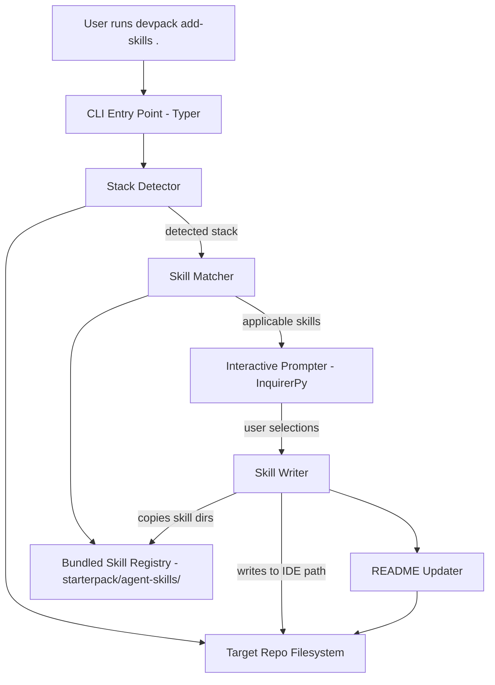
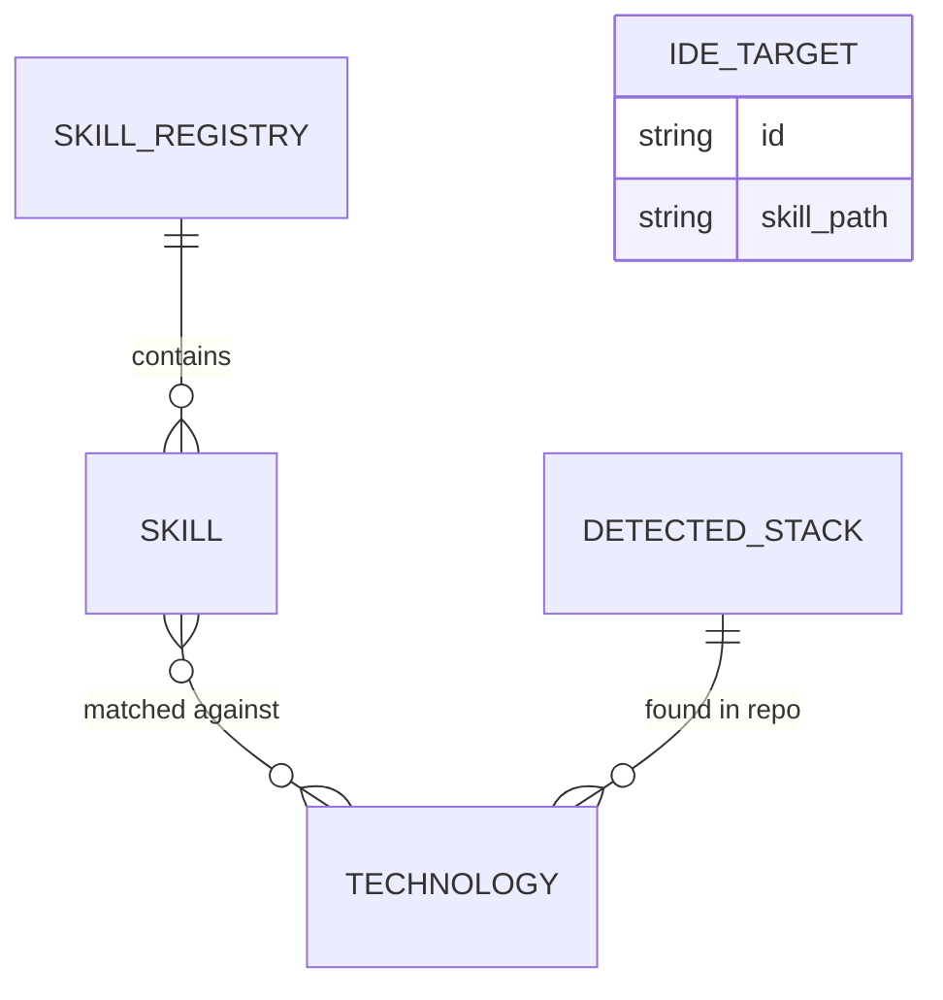

# System Design: DevPack — `add-skills` MVP

## 1. Architecture Overview

DevPack is a single-process CLI application. There are no servers, databases, or external services — everything runs locally and operates on the filesystem.



**Components:**

- **CLI Entry Point (Typer)** — Parses the `add-skills <repo_path>` command and orchestrates the flow.
- **Stack Detector** — Reads config files in the target repo (package.json, pyproject.toml, requirements.txt, Gemfile, etc.) and produces a list of detected technologies (e.g. `["python", "django", "postgres"]` or `["typescript", "react", "vite"]`).
- **Skill Registry** — The bundled collection of curated skills, stored as ready-to-use subdirectories under `starterpack/agent-skills/`. Each skill is a directory containing a `SKILL.md` (with a name and description in its frontmatter) and optional supporting files. Skills are categorized as general frontend (e.g. `optimize-lighthouse-metrics`), general backend, framework-specific (e.g. `django-best-practices`), or general workflows (e.g. `feature-implementation-plan`).
- **Skill Matcher** — Takes the detected stack and determines which skills are relevant by analyzing each skill's name and description against the detected technologies. There are no explicit tags — the matcher infers applicability (e.g. a skill named `django-best-practices` whose description mentions Django is matched when Django is detected).
- **Interactive Prompter (InquirerPy)** — Presents the matched skills as a checkbox list (all selected by default), then asks which IDE/agent format to generate for.
- **Skill Writer** — Takes the confirmed skill selections + target IDE and copies the skill directories as-is into the correct location in the repo. The skill content is identical across all IDEs — only the destination path differs.
- **README Updater** — Appends or updates a "Skills" section in the repo's README with usage instructions for the added skills.

**Key decision:** This is a pure CLI tool with no network calls, no config files outside the target repo, and no persistent state. Skills ship with the package. This keeps the MVP dead simple — install it, run it, done.

## 2. Data Model

There's no database. The "data model" is the internal representation of skills and detected stacks.



### Skill

A single unit of best-practice knowledge that gets installed into a repo. Each skill is a self-contained directory under `starterpack/agent-skills/` containing a `SKILL.md` file and optional supporting files (e.g. `rules/`, `references/`). The skill format is universal — the same content works for all supported IDEs.

| Attribute     | Description                                                                |
| ------------- | -------------------------------------------------------------------------- |
| `id`          | Directory name / unique slug, e.g. `django-best-practices`, `optimize-lighthouse-metrics` |
| `name`        | Human-readable display name (from SKILL.md frontmatter)                    |
| `description` | One-line description shown during selection (from SKILL.md frontmatter)    |
| `path`        | Path to the skill directory in the bundled starterpack                      |

Skills have no explicit tags. The Skill Matcher determines relevance by analyzing each skill's name and description against the detected technologies. For example, `django-best-practices` (description mentions "Django application best practices") is matched when Django is detected; `optimize-lighthouse-metrics` (description mentions "web performance") is matched for any frontend stack; `feature-implementation-plan` is a general workflow skill offered to all projects.

### Technology

A detectable technology or framework.

| Attribute    | Description                                                                         |
| ------------ | ----------------------------------------------------------------------------------- |
| `id`         | Slug, e.g. `django`, `react`, `fastapi`, `python`                                  |
| `name`       | Display name                                                                        |
| `indicators` | List of detection rules — config files, dependency names, or file patterns to check |

### IDE Target

A target coding tool that determines where skills are placed in the repo.

| Attribute      | Description                                                               |
| -------------- | ------------------------------------------------------------------------- |
| `id`           | Slug: `claude-code`, `cursor`, `vscode`                                   |
| `name`         | Display name                                                              |
| `skill_path`   | Where skill directories go in the repo                                    |

The skill paths per IDE:
- **VS Code**: `.agents/skills/<skill-name>/`
- **Claude Code**: `.claude/skills/<skill-name>/`
- **Cursor**: `.cursor/skills/<skill-name>/`

The Skill Writer copies each selected skill's directory (SKILL.md + any supporting files) into the appropriate path. No content transformation is needed — the format is universal.

## 3. CLI Interface

Single command for the MVP:

```
devpack add-skills <repo_path>
```

| Argument/Option | Description                              | Default |
| --------------- | ---------------------------------------- | ------- |
| `repo_path`     | Path to the target repository            | `.`     |

The command is fully interactive — no flags needed for the MVP. The flow is:

1. **Detect** — Scan `repo_path` for config files and identify technologies.
2. **Match** — Filter the skill registry to skills matching the detected stack.
3. **Present** — Show a checkbox list of matched skills (all pre-selected) with names and short descriptions. User toggles on/off and confirms.
4. **Choose IDE** — Prompt for target IDE/agent format (Cursor, VS Code Copilot, Claude Code). If only one is detected in the repo already, default to that.
5. **Write** — Copy the selected skill directories into the correct location for the chosen IDE.
6. **Update README** — Add/update a skills section in the repo's README.
7. **Summary** — Print what was added and where.

### Output example

```
Detected stack: Python, Django, PostgreSQL

Applicable skills:
  [x] Django Best Practices — Project structure, views, and ORM patterns
  [x] Django Security — CSRF, auth, and common vulnerability prevention
  [x] Python Testing — pytest patterns and test organization
  [ ] Lighthouse Performance — Frontend performance optimization

Target IDE: Claude Code

Added 3 skills to .claude/skills/
Updated README.md with skills documentation.
```

## 4. Project Structure

```
devpack/
├── pyproject.toml
├── src/
│   └── devpack/
│       ├── __init__.py
│       ├── cli.py              # Typer app, command definitions
│       ├── detector.py         # Stack detection logic
│       ├── matcher.py          # Filters skills by detected stack
│       ├── prompter.py         # InquirerPy interactive prompts
│       ├── writer.py           # Copies skill directories to repo
│       ├── readme_updater.py   # README manipulation
│       ├── models.py           # Dataclasses: Skill, Technology, IDETarget
│       └── registry/
│           ├── __init__.py
│           └── technologies.py # Technology definitions + detection rules
├── starterpack/
│   └── agent-skills/           # Curated skills, each a self-contained directory
│       ├── optimize-lighthouse-metrics/
│       │   └── SKILL.md
│       ├── django-best-practices/
│       │   ├── SKILL.md
│       │   └── rules/
│       ├── react-best-practices/
│       │   ├── SKILL.md
│       │   └── rules/
│       ├── feature-implementation-plan/
│       │   └── SKILL.md
│       └── ...
├── tests/
│   ├── test_detector.py
│   ├── test_matcher.py
│   ├── test_writer.py
│   └── fixtures/          # Fake repo structures for testing detection
│       ├── django_repo/
│       ├── react_repo/
│       └── ...
└── README.md
```

### Why this structure

- **`registry/`** keeps technology definitions as Python data (not YAML/JSON). At this scale, Python dataclasses are simpler to author, validate, and iterate on than external config files.
- **`starterpack/agent-skills/`** holds the curated skills as self-contained directories. Each skill is a directory with a `SKILL.md` and optional supporting files. These are copied as-is into the target repo — no transformation needed. Keeping them as real files makes them easy to read, edit, and preview.
- The skill catalog is discovered at runtime by scanning `starterpack/agent-skills/` and parsing each skill's `SKILL.md` frontmatter (name, description). No separate Python skill registry is needed.
- Each module maps 1:1 to a step in the CLI flow, so the orchestration in `cli.py` is a simple pipeline.

## 5. Stack Detection Strategy

Detection reads well-known config files and checks for specific dependencies or patterns. No deep parsing needed.

| Signal File          | Extracts                                                       |
| -------------------- | -------------------------------------------------------------- |
| `package.json`       | JS/TS runtime, framework (react, vue, next, express, etc.) from `dependencies` |
| `pyproject.toml`     | Python, framework (django, fastapi, flask) from `[project.dependencies]` or `[tool.poetry.dependencies]` |
| `requirements.txt`   | Python, framework from package names                           |
| `Gemfile`            | Ruby, framework (rails) from gem names                         |
| `go.mod`             | Go, framework from module imports                              |
| `Cargo.toml`         | Rust                                                           |
| `Dockerfile`         | Notes containerized setup                                      |
| `docker-compose.yml` | Detects services (postgres, redis, etc.)                       |

Each technology in the registry defines its own detection rules as simple callables that receive a repo path and return a confidence boolean. The detector runs all rules and collects matches.

## 6. Key Decisions & Tradeoffs

**Skills bundled in the package vs. fetched remotely** — Skills ship with the pip install. This means updating skills requires a new release, but it eliminates network dependencies, auth complexity, and versioning headaches. For an MVP with a curated list, this is the right call. If the skill catalog grows large or needs community contributions, a remote registry can be added later.

**Python data for technologies, filesystem for skills** — Technology definitions live in Python modules as dataclasses (type checking, IDE autocomplete, zero parsing overhead). Skills live as plain directories with markdown files in `starterpack/agent-skills/`, discovered at runtime by scanning the directory and parsing SKILL.md frontmatter. This means adding a new skill is just adding a new directory — no Python code changes needed.

**One command, fully interactive** — No flags or config file for the MVP. The interactive flow is short (two prompts) and covers the decisions that matter. CLI flags for non-interactive use (CI pipelines, scripting) can be added later without breaking anything.

**Inferred matching vs. explicit tags** — Rather than tagging each skill with technology identifiers, the matcher infers relevance from each skill's name and description. A skill named `django-best-practices` whose description mentions "Django" is automatically matched when Django is detected. This is simpler to maintain (no tags to keep in sync) and handles cross-cutting skills naturally — `optimize-lighthouse-metrics` mentions "web performance" and can be matched to any frontend stack. General workflow skills like `feature-implementation-plan` are offered to all projects.

**Universal skill format across IDEs** — All supported IDEs (VS Code, Claude Code, Cursor) accept the same skill format: a directory containing a `SKILL.md` and optional supporting files. The only difference is where the skill directories are placed in the repo (`.agents/skills/`, `.claude/skills/`, `.cursor/skills/`). This eliminates the need for per-IDE templates and means the Skill Writer is a simple directory copy.
