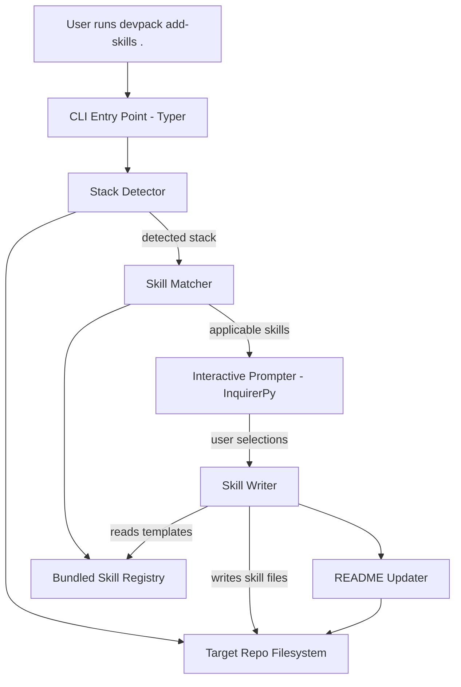
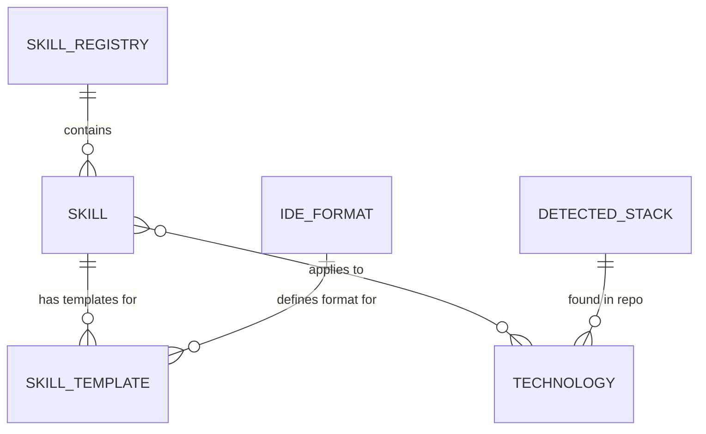

# System Design: DevPack — `add-skills` MVP

## 1. Architecture Overview

DevPack is a single-process CLI application. There are no servers, databases, or external services — everything runs locally and operates on the filesystem.



**Components:**

- **CLI Entry Point (Typer)** — Parses the `add-skills <repo_path>` command and orchestrates the flow.
- **Stack Detector** — Reads config files in the target repo (package.json, pyproject.toml, requirements.txt, Gemfile, etc.) and produces a list of detected technologies (e.g. `["python", "django", "postgres"]` or `["typescript", "react", "vite"]`).
- **Skill Registry** — A bundled catalog of all curated skills, each tagged with which technologies it applies to and which IDE formats it supports.
- **Skill Matcher** — Takes the detected stack and filters the registry down to applicable skills.
- **Interactive Prompter (InquirerPy)** — Presents the matched skills as a checkbox list (all selected by default), then asks which IDE/agent format to generate for.
- **Skill Writer** — Takes the confirmed skill selections + target IDE format and writes the appropriate files into the repo. Each skill has template content per IDE format.
- **README Updater** — Appends or updates a "Skills" section in the repo's README with usage instructions for the added skills.

**Key decision:** This is a pure CLI tool with no network calls, no config files outside the target repo, and no persistent state. Skills ship with the package. This keeps the MVP dead simple — install it, run it, done.

## 2. Data Model

There's no database. The "data model" is the internal representation of skills and detected stacks.



### Skill

A single unit of best-practice knowledge that gets installed into a repo.

| Attribute     | Description                                                                |
| ------------- | -------------------------------------------------------------------------- |
| `id`          | Unique slug, e.g. `django-security`, `react-best-practices`               |
| `name`        | Human-readable display name                                                |
| `description` | One-line description shown during selection                                |
| `tags`        | List of technology identifiers this skill applies to (e.g. `["django"]`)   |
| `templates`   | Dict mapping IDE format to the skill's content/file structure for that IDE |

### Technology

A detectable technology or framework.

| Attribute    | Description                                                                         |
| ------------ | ----------------------------------------------------------------------------------- |
| `id`         | Slug, e.g. `django`, `react`, `fastapi`, `python`                                  |
| `name`       | Display name                                                                        |
| `indicators` | List of detection rules — config files, dependency names, or file patterns to check |

### IDE Format

A target coding tool that skills get generated for.

| Attribute      | Description                                                               |
| -------------- | ------------------------------------------------------------------------- |
| `id`           | Slug: `claude-code`, `cursor`, `vscode`                                   |
| `name`         | Display name                                                              |
| `skill_path`   | Where skill files go in the repo (e.g. `.claude/skills/`, `.cursor/skills/`) |
| `file_format`  | How skill content is structured (markdown files, JSON, etc.)              |

### Modeling decision

Skills are tagged with technologies rather than organized in a strict hierarchy. A skill like `lighthouse-performance` might tag `["react", "vue", "next"]` — it applies to any frontend framework. This avoids duplicating skills across categories and makes matching simple: if any of a skill's tags overlap with the detected stack, it's a candidate.

## 3. CLI Interface

Single command for the MVP:

```
devpack add-skills <repo_path>
```

| Argument/Option | Description                              | Default |
| --------------- | ---------------------------------------- | ------- |
| `repo_path`     | Path to the target repository            | `.`     |

The command is fully interactive — no flags needed for the MVP. The flow is:

1. **Detect** — Scan `repo_path` for config files and identify technologies.
2. **Match** — Filter the skill registry to skills matching the detected stack.
3. **Present** — Show a checkbox list of matched skills (all pre-selected) with names and short descriptions. User toggles on/off and confirms.
4. **Choose IDE** — Prompt for target IDE/agent format (Cursor, VS Code Copilot, Claude Code). If only one is detected in the repo already, default to that.
5. **Write** — Generate skill files in the correct format and location for the chosen IDE.
6. **Update README** — Add/update a skills section in the repo's README.
7. **Summary** — Print what was added and where.

### Output example

```
Detected stack: Python, Django, PostgreSQL

Applicable skills:
  [x] Django Best Practices — Project structure, views, and ORM patterns
  [x] Django Security — CSRF, auth, and common vulnerability prevention
  [x] Python Testing — pytest patterns and test organization
  [ ] Lighthouse Performance — Frontend performance optimization

Target IDE: Claude Code

Added 3 skills to .claude/skills/
Updated README.md with skills documentation.
```

## 4. Project Structure

```
devpack/
├── pyproject.toml
├── src/
│   └── devpack/
│       ├── __init__.py
│       ├── cli.py              # Typer app, command definitions
│       ├── detector.py         # Stack detection logic
│       ├── matcher.py          # Filters skills by detected stack
│       ├── prompter.py         # InquirerPy interactive prompts
│       ├── writer.py           # Writes skill files to repo
│       ├── readme_updater.py   # README manipulation
│       ├── models.py           # Dataclasses: Skill, Technology, IDEFormat
│       ├── registry/
│       │   ├── __init__.py
│       │   ├── technologies.py # Technology definitions + detection rules
│       │   └── skills.py       # Curated skill catalog
│       └── templates/          # Skill content templates organized by IDE format
│           ├── claude-code/
│           │   ├── django-security.md
│           │   ├── react-best-practices.md
│           │   └── ...
│           ├── cursor/
│           │   └── ...
│           └── vscode/
│               └── ...
├── tests/
│   ├── test_detector.py
│   ├── test_matcher.py
│   ├── test_writer.py
│   └── fixtures/          # Fake repo structures for testing detection
│       ├── django_repo/
│       ├── react_repo/
│       └── ...
└── README.md
```

### Why this structure

- **`registry/`** keeps skill and technology definitions as Python data (not YAML/JSON). At this scale, Python dataclasses are simpler to author, validate, and iterate on than external config files.
- **`templates/`** holds the actual skill content as plain files (mostly markdown). These are the files that get copied/adapted into the target repo. Keeping them as real files rather than strings in Python makes them easy to read, edit, and preview.
- Each module maps 1:1 to a step in the CLI flow, so the orchestration in `cli.py` is a simple pipeline.

## 5. Stack Detection Strategy

Detection reads well-known config files and checks for specific dependencies or patterns. No deep parsing needed.

| Signal File          | Extracts                                                       |
| -------------------- | -------------------------------------------------------------- |
| `package.json`       | JS/TS runtime, framework (react, vue, next, express, etc.) from `dependencies` |
| `pyproject.toml`     | Python, framework (django, fastapi, flask) from `[project.dependencies]` or `[tool.poetry.dependencies]` |
| `requirements.txt`   | Python, framework from package names                           |
| `Gemfile`            | Ruby, framework (rails) from gem names                         |
| `go.mod`             | Go, framework from module imports                              |
| `Cargo.toml`         | Rust                                                           |
| `Dockerfile`         | Notes containerized setup                                      |
| `docker-compose.yml` | Detects services (postgres, redis, etc.)                       |

Each technology in the registry defines its own detection rules as simple callables that receive a repo path and return a confidence boolean. The detector runs all rules and collects matches.

## 6. Key Decisions & Tradeoffs

**Skills bundled in the package vs. fetched remotely** — Skills ship with the pip install. This means updating skills requires a new release, but it eliminates network dependencies, auth complexity, and versioning headaches. For an MVP with a curated list, this is the right call. If the skill catalog grows large or needs community contributions, a remote registry can be added later.

**Python data for the registry vs. YAML/JSON config files** — Skill and technology definitions live in Python modules as dataclasses rather than external config. This gives us type checking, IDE autocomplete, and zero parsing overhead. The tradeoff is that non-Python contributors can't edit the registry without touching Python, but for now the maintainer team is small and Python-native.

**One command, fully interactive** — No flags or config file for the MVP. The interactive flow is short (two prompts) and covers the decisions that matter. CLI flags for non-interactive use (CI pipelines, scripting) can be added later without breaking anything.

**Tag-based skill matching vs. hierarchical categories** — Skills are tagged with technologies rather than nested under framework categories. This is simpler and handles cross-cutting skills (e.g. `lighthouse-performance` applying to multiple frontend frameworks) without duplication. The downside is no browsable category tree, but with a curated list of ~15-30 skills that's not a problem.

**Template files per IDE format** — Each skill has separate template files for each supported IDE. This means some content duplication across formats, but the formats are different enough (Cursor skills use a specific YAML frontmatter, Claude Code uses `.claude/skills/` markdown, VS Code has its own structure) that trying to share a single source and transform it would be more complex than just maintaining separate templates.
